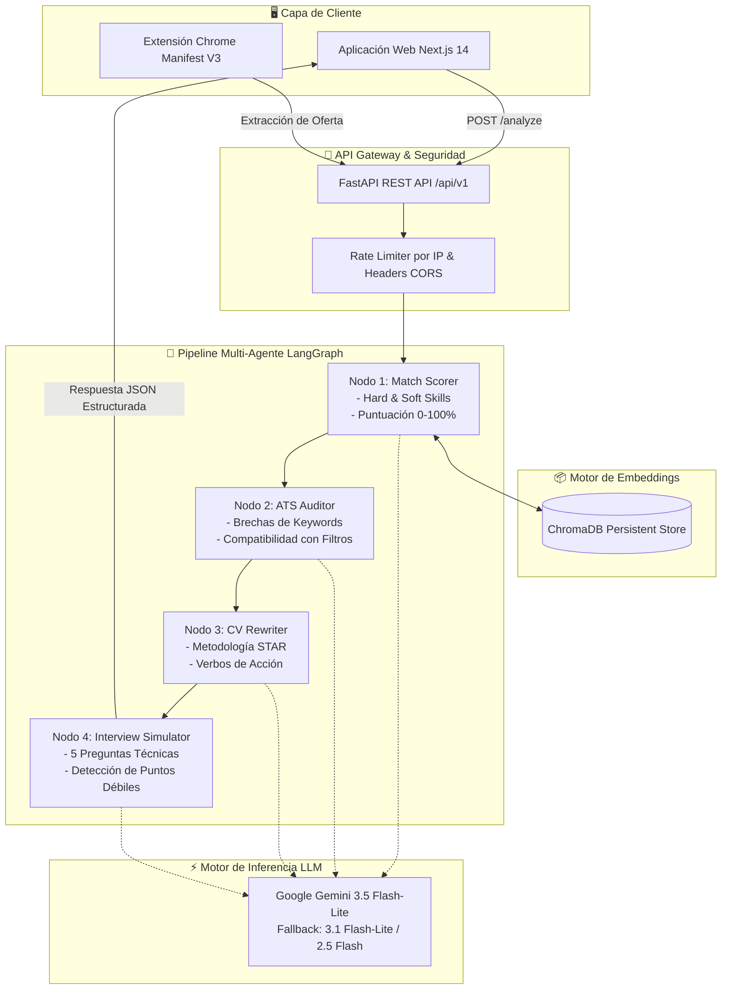

<div align="center">

# 🎯 StrapyATS
### Optimizador de CV y Auditor ATS con Inteligencia Artificial Multi-Agente

[](https://www.strapyats.com)
[](https://fastapi.tiangolo.com)
[](https://nextjs.org)
[](https://cloud.google.com/run)
[](https://github.com/langchain-ai/langgraph)
[](LICENSE)

<p align="center">
  <b>Compara, califica y reescribe currículums para superar los filtros ATS (Workday, Greenhouse, Taleo) en segundos mediante un flujo de agentes de IA deterministas.</b>
</p>

[🌐 Probar Aplicación Web](https://www.strapyats.com) • [📖 Documentación API Swagger](https://strapyats-1070761475262.us-central1.run.app/docs) • [🧩 Extensión Chrome](./chrome-extension) • [🐛 Reportar Problema](https://github.com/iariasdev/StrapyATS/issues)

---

</div>

## 🌟 ¿Qué es StrapyATS?

**StrapyATS** es una plataforma de código abierto desarrollada para cerrar la brecha semántica y léxica entre las ofertas laborales y los currículums de los candidatos en el mercado hispanohablante y global.

A diferencia de los verificadores simples de CV basados en prompts básicos, **StrapyATS** implementa una **máquina de estados multi-agente con LangGraph** y una base de datos vectorial local con **ChromaDB**, ejecutando una auditoría exhaustiva de brechas de palabras clave, reescritura de logros con metodología STAR cuantificable y simulación de preguntas difíciles de entrevista técnica.

---

## ⚡ Características Principales

- 🤖 **Pipeline Multi-Agente**: Orquestado con **LangGraph** a través de 4 nodos deterministas (`Match Scorer` ➔ `ATS Auditor` ➔ `CV Rewriter` ➔ `Interview Simulator`).
- ⚡ **Cascada de Modelos Gemini**: Modelo principal **Gemini 3.5 Flash-Lite** con tolerancia a fallos automática (`3.5 Flash-Lite` ➔ `3.1 Flash-Lite` ➔ `2.5 Flash`).
- 🧠 **Búsqueda Vectorial Semántica (RAG)**: Indexación y embeddings de fragmentos del CV en **ChromaDB** para calcular similitud coseno contra los requisitos de la vacante.
- 🔐 **Privacidad Total & Modelo BYOK**: Procesamiento 100% en memoria (sin retención de CVs) + soporte **BYOK** (Bring Your Own Key) para usar tu propia API Key de Google AI Studio.
- 🧩 **Extensión de Chrome (Manifest V3)**: Extracción en 1 clic de ofertas laborales directamente desde LinkedIn, GetOnBoard, Indeed y portales de empleo.
- ☁️ **Infraestructura Cloud de Alta Disponibilidad**: Backend desplegado en **Google Cloud Run** y Frontend optimizado en la red global de **Vercel** con dominio propio.

---

## 🏗️ Arquitectura del Sistema



---

## 🛠️ Stack Tecnológico

| Capa | Tecnología |
| :--- | :--- |
| **Backend API** | FastAPI (Python 3.11), Pydantic v2, Uvicorn |
| **Orquestación de IA** | LangGraph, LangChain Core |
| **Base de Datos Vectorial (RAG)** | ChromaDB PersistentClient |
| **Modelos LLM** | Google Gemini (3.5 Flash-Lite, 3.1 Flash-Lite, 2.5 Flash) |
| **Observabilidad de LLMs** | Langfuse Cloud |
| **Frontend Web** | Next.js 14 (App Router), React 18, Tailwind CSS, Lucide Icons |
| **Generación de PDF** | Client-Side `@media print` / CSS especializado ATS |
| **Extensión de Navegador** | Google Chrome Manifest V3 |
| **Despliegue Backend** | Google Cloud Run + Cloud Build (CI/CD) |
| **Despliegue Frontend** | Vercel Edge Network (`strapyats.com`) |

---

## 📂 Estructura del Repositorio

```text
StrapyATS/
├── backend/                  # Servicio Microservice FastAPI (Python 3.11)
│   ├── app/
│   │   ├── agent/            # Pipeline LangGraph, cliente Gemini y prompts
│   │   │   ├── nodes/        # match_scorer, ats_auditor, cv_rewriter, interview
│   │   │   └── graph.py      # Definición de la máquina de estados
│   │   ├── api/routes/       # Endpoints REST (/analyze, /extract-pdf, /extract-job-url)
│   │   ├── core/             # Configuración, CORS, settings y variables de entorno
│   │   ├── models/           # Esquemas Pydantic de entrada y salida
│   │   ├── services/         # Extracción de PDF, scraper web y rate limiter
│   │   └── vectorstore/      # Gestor de embeddings ChromaDB
│   ├── Dockerfile            # Configuración para contenedor en Google Cloud Run
│   └── requirements.txt      # Dependencias Python
│
├── frontend/                 # Aplicación Web Next.js 14
│   ├── src/
│   │   ├── app/              # Enrutador, layout principal y estilos globales
│   │   ├── components/       # Formulario, Resultados, Modal BYOK e Historial
│   │   ├── lib/              # Cliente API y utilidades
│   │   └── types/            # Tipado TypeScript
│   └── package.json
│
├── chrome-extension/         # Extensión para Chrome (Manifest V3)
│   ├── manifest.json
│   ├── popup.html / popup.js
│   └── content_script.js     # Extractor DOM para portales de empleo
│
└── docs/                     # Documentación de arquitectura
```

---

## 🚀 Guía de Instalación Local

### Requisitos Previos
- **Python 3.11+**
- **Node.js 18+** y **npm**
- **Clave de API de Gemini** (Obtenla gratis en [Google AI Studio](https://aistudio.google.com/))

---

### 1. Clonar el Repositorio
```bash
git clone https://github.com/iariasdev/StrapyATS.git
cd StrapyATS
```

---

### 2. Configurar el Backend
```bash
cd backend

# Crear y activar entorno virtual
python -m venv venv

# En Windows:
.\venv\Scripts\activate
# En macOS/Linux:
# source venv/bin/activate

# Instalar dependencias
pip install -r requirements.txt

# Copiar plantilla de entorno
cp .env.example .env
```

Configura tu archivo `backend/.env`:
```env
GOOGLE_API_KEY=tu_clave_de_gemini_aqui
GEMINI_MODEL=gemini-3.5-flash-lite
ENVIRONMENT=development
MAX_REQUESTS_PER_IP_PER_DAY=9999
CHROMA_PERSIST_PATH=./chroma_db
```

Iniciar el servidor de desarrollo:
```bash
uvicorn app.main:app --reload --host 0.0.0.0 --port 8000
```
*Documentación interactiva disponible en:* `http://localhost:8000/docs`

---

### 3. Configurar el Frontend
```bash
cd ../frontend

# Instalar librerías
npm install

# Copiar variables de entorno
cp .env.example .env.local
```

Configura `frontend/.env.local`:
```env
NEXT_PUBLIC_API_BASE_URL=http://localhost:8000/api/v1
```

Iniciar el servidor frontend:
```bash
npm run dev
```
*Aplicación disponible en:* `http://localhost:3000`

---

### 4. Cargar la Extensión de Chrome
1. Abre Google Chrome y ve a `chrome://extensions/`
2. Activa el **Modo de desarrollador** (esquina superior derecha).
3. Haz clic en **Cargar descomprimida** y selecciona la carpeta `chrome-extension/`.
4. Fija la extensión y úsala directamente sobre ofertas en LinkedIn o GetOnBoard.

---

## 🔒 Privacidad y Seguridad

- **Cero Retención de Datos**: Los currículums se procesan exclusivamente en memoria durante la ejecución de los agentes y se descartan inmediatamente.
- **Soporte BYOK**: Opción para que los usuarios ingresen su propia clave de API de Gemini, permitiendo uso ilimitado sin depender de cuotas compartidas.
- **Políticas de CORS Estrictas**: Backend protegido con orígenes controlados (`strapyats.com`, `chrome-extension://*`).
- **Control de Peticiones**: Rate limiting por ventana deslizante de IP para prevenir abusos.

---

## 🤝 Contribuciones

Las contribuciones son bienvenidas. Si deseas colaborar:

1. Realiza un Fork del repositorio
2. Crea tu rama de función (`git checkout -b feature/NuevaCaracteristica`)
3. Haz commit de tus cambios (`git commit -m 'feat: agregar nueva caracteristica'`)
4. Haz push a la rama (`git push origin feature/NuevaCaracteristica`)
5. Abre un Pull Request

---

## 📜 Licencia

Este proyecto está bajo la Licencia **MIT**. Consulta el archivo [`LICENSE`](LICENSE) para más detalles.

---

<div align="center">

**Desarrollado con ❤️ por [@iariasdev](https://github.com/iariasdev) — Powered by CierraLab**

[](https://github.com/iariasdev)
[](https://www.linkedin.com/)

</div>
